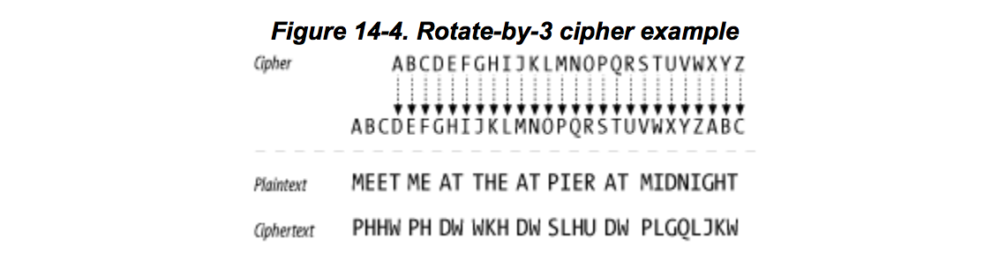
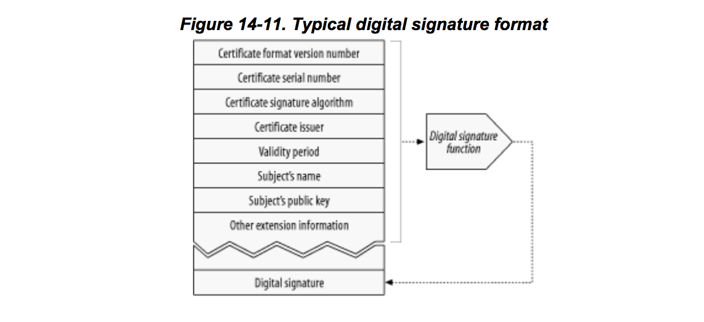

# HTTPS
《[HTTP: The Definitive Guide]》阅读笔记。

>...a more complicated and aggresive technology to secure HTTP transactions from eavesdropping and tampering, using digital cryptography.

## 需求
* 服务器认证（Server authentication）。客户端能确定服务器的真实身份
* 客户端认证（Client authentication）。服务器能确定客户端的真实身份
* 完整校验（Integrity）。不用害怕数据被篡改。
* 加密（Encryption）。不用害怕被监听。
* 高效（Efficiency）。服务器和客户端执行都足够快。
* 通用（Ubiquity）。协议能很好地被几乎所有服务器和客户端支持。
* Administrative scalability (instant secure communication for anyone, anywhere)
* Adaptability (supports the best known security methods of the day)
* Social viability (meets the cultural and political needs of the society)

## 数字加密
这是HTTPS的核心技术之一，即在明文（plaintext）和密文（ciphertext）间进行转换的编码技术。

### 加密算法和密钥
加密的核心是加密算法（cipher）和密钥（key）。

传说凯撒曾使用过一种“三字符旋转”（three-character rotation）加密方式，
将消息中的每个字母都用字母表中比它排列靠后三个位置的字母替代。



这里的加密算法就是字母旋转，密钥是3.
必须同时知道这两个信息才能加密和解密。
这样，即使用大家都知道的加密算法，通常只要密钥不被破解，就不用担心密文被破解。

当然，字母旋转这种加密算法太简单，密钥的可能性只有26种，很容易穷举破解。
现代加密算法的好处就在于其密钥空间足够大，即使目前最快的计算机去穷举，在有生之年也难以完成破解。

将密钥的二进制位数称其长度，则长度为128位的密钥就有大概
262,000,000,000,000,000,000,000,000,000,000,000,000
种可能。


### 对称加密与非对称加密
加密算法通常由加密和解密两部分组成，各自对应一个密钥。
如果加密和解密使用同样的密钥，则称之为对称加密；否则为非对称加密。

对称加密的好处是执行速度较快，其不足是需要的密钥数量大，难以管理。
譬如N个人之间通信，需要两两均确定一个密钥，密钥数量为N*(N-1)/2，每个节点需要维护N-1个密钥。

公钥加密算法是一种常见的非对称加密。
每个节点产生2个不同的密钥：公钥和私钥。公钥会公布出去，私钥则作为秘密自己藏起来。
假设Alice要向Bob发送消息，就会用Bob的公钥对消息进行加密，
这个密文只有用Bob的私钥才能解密。
可见，虽然非对称加密执行速度较慢，但N个人之间通信只需要产生2N个密钥，每个节点只需要维护2个。

实际应用中，通常用非对称加密建立通道，约定一个密钥后再使用对称加密进行通信。
这样便兼顾了性能和维护。

### RSA
在现实情况中，第三方可能拿到以下信息：

* 公钥
* 一段密文
* 一段消息及对应的密文

公钥非对称加密算法需要保证即使全部拿到以上信息，
以及知道是用哪种加密算法（甚至实现），都无法破解私钥和密文对应的明文。

[RSA]是一种非常流行的公钥加密算法，它便可以做到如上要求。

其依赖的基本原理是，可以找到三个大整数`e`, `d`, `n`，对于任意的整数`m`，下面的等式都成立：


上式左边的运算称为[模幂]，它有`log(ed)`级别的解法。
在这里它最有用的特点就是，即使知道了`e`, `n`, `m`，也很难计算出`d`。

它还有个特点，`e`和`d`是可以交换的，即上面的等式可以推出下面的等式：


Bob发送消息给Alice的过程如下：
* Alice将`(n, e)`作为公钥告诉Bob，`(n, d)`作为私钥自己保管。
* Bob想将消息`M`发送给Alice。先将`M`拆解成多个`m`，且`0 ≤ m < n`，`gcd(m, n) = 1`，即`m`小于`n`且与`n`互质。
  这部拆解需要用到某种[padding]算法。
* Bob利用Alice的公钥`(n, e)`对`m`进行加密。


* 利用前面提到的`e`和`d`可以互换的特性，Alice可以用如下方式从`c`解出`m`，再得到`M`。


注意，在不知道`d`的情况下，知道`c`，`n`和`e`，是无法算出`m`的。
这里唯一知道的就是`0 ≤ m < n`，而`n`的长度就是所谓的密钥的长度。
给定1024位的话，`m`的可能性空间非常大，穷举就不现实了。

#### 公钥与私钥的生成
如上所述，公钥为`(n, e)`，私钥为`(n, d)`。
在`n`足够大的情况下，要想秘密（`m`）不被破解，就需要保证上面提到的两点：
* 可以找到满足条件的`e`, `d`, `n`
* 从`e`, `n`, `m`无法计算出`d`

事实上，`e`, `d`, `n`的生成过程是这样的：
* 随机选两个足够大的质数`p`和`q`。
* `n = pq`。`n`的长度被称为密钥的长度。
* 计算`n`的欧拉函数值。这个值的含义是，小于等于`n`且与`n`互质的正整数个数。
```
φ(n) = φ(p)φ(q) = (p − 1)(q − 1) = n - (p + q -1)

```
* 选取`e`，使得`1 < e < φ(n)`，且`gcd(e, φ(n)) = 1`，即`e`与`φ(n)`互质。
  通常选`e = 65537`。`e`就是公钥指数。
* 从`d⋅e ≡ 1 (mod φ(n))`中计算出`d`，作为私钥指数。

先考虑上面提到的第二点要求：从`e`, `n`, `m`无法计算出`d`。
从最后计算`d`的表达式可以知道，要得到`d`，必须知道`φ(n)`，但其值是保密的，只能推断。
由`φ(n) = (p − 1)(q − 1)`可知，从`n = pq`推断出`φ(n)`，则必须对`n`进行因式分解。
正是因为这个因式分解的难度很大，才使得[RSA]难以破解。
当当`n`很大时（如1024位），可以认为无解。目前已知能破解的最大长度为768位。

关于第一点要求的证明，可见[维基百科#RSA]。

### 数字签名
[数字签名]的目的便是验证当前收到的消息是否来自某某，是否有被篡改。
它使用非对称加密来实现。

下面看一个使用[RSA]来进行[数字签名]的例子。
* A先将消息映射成固定长度的摘要（digest）。譬如使用[MD5]就可以将任意长度的消息映射成128位。
* 使用[RSA]的解密函数`D`将摘要（`c`）映射成签名（`m`）。
  从前面可知`D`是利用私钥做的[模幂]运算，在不知道`d`的情况下，是无法得出`m`的。
  所以，只有A能生成这个签名。
* A将计算好的签名连接到信息后，一起发送给B。
* 如果B想验证收到的消息是否来自A，且是否有被篡改，
  可以使用A的公钥对签名进行加密，得到摘要，与从消息体计算出来的摘要进行对比。


### 数字证书
有了[数字签名]机制，[数字证书]便很容易实现了。

身份证之所以能证明你的身份，是因为大家相信身份证的颁发机构，以及相信身份证难以造假。

[数字证书]证明的是公钥的正确归属，需要权威机构做担保。
证书分为两部分内容，一部分是信息描述，其中包含公钥。
第二部分是权威机构的签名，即用它的私钥针对第一部分内容生成的一个[数字签名]。



网站需要向[CA]申请对应域名的数字证书，[CA]会留下自己的[数字签名]。
浏览器在与网站通信时，先下载它的证书，检查是哪个[CA]签发的，再找出对应[CA]的公钥，如同[数字签名]中描述的那样进行验证。


## HTTPS协议

## 相关
* [Crash course on cryptography](http://www.iusmentis.com/technology/encryption/crashcourse/)
* [Computer Networks: A Systems Approach](http://www.pdfiles.com/pdf/files/English/Networking/Computer_Networks_A_Systems_Approach.pdf)
* [阮一峰：RSA算法原理（一）](http://www.ruanyifeng.com/blog/2013/06/rsa_algorithm_part_one.html)
* [阮一峰：RSA算法原理（二）](http://www.ruanyifeng.com/blog/2013/07/rsa_algorithm_part_two.html)


[HTTP: The Definitive Guide]: http://www.staroceans.org/e-book/O'Reilly%20-%20HTTP%20-%20The%20Definitive%20Guide.pdf
[RSA]: https://en.wikipedia.org/wiki/RSA_(cryptosystem)
[模幂]: https://en.wikipedia.org/wiki/Modular_exponentiation
[padding]: https://en.wikipedia.org/wiki/Padding_(cryptography)
[MD5]: https://en.wikipedia.org/wiki/MD5
[数字签名]: https://en.wikipedia.org/wiki/Digital_signature
[数字证书]: https://en.wikipedia.org/wiki/Public_key_certificate
[欧拉函数]: https://en.wikipedia.org/wiki/Euler%27s_totient_function
[维基百科#RSA]: https://en.wikipedia.org/wiki/RSA_(cryptosystem)#Proofs_of_correctness
[CA]: https://en.wikipedia.org/wiki/Certificate_authority

