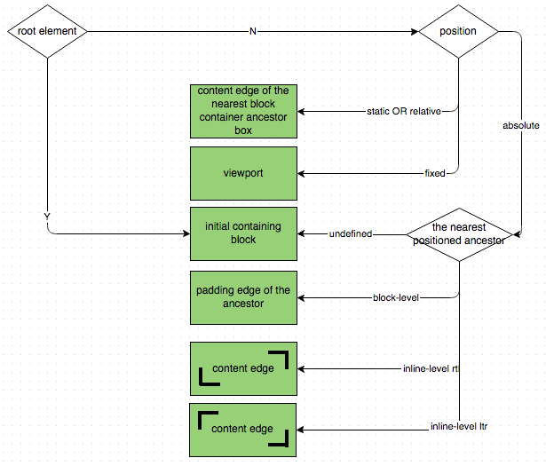
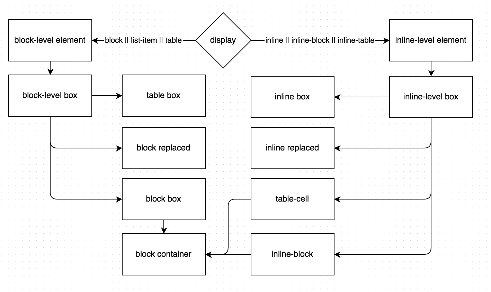
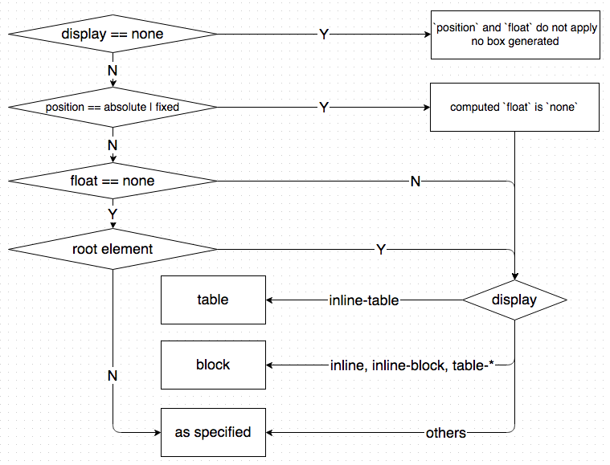
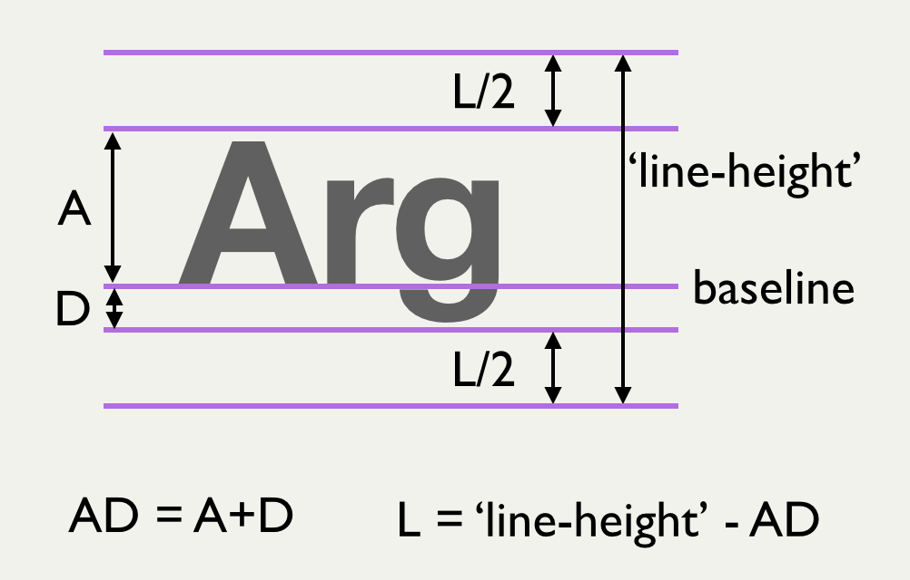
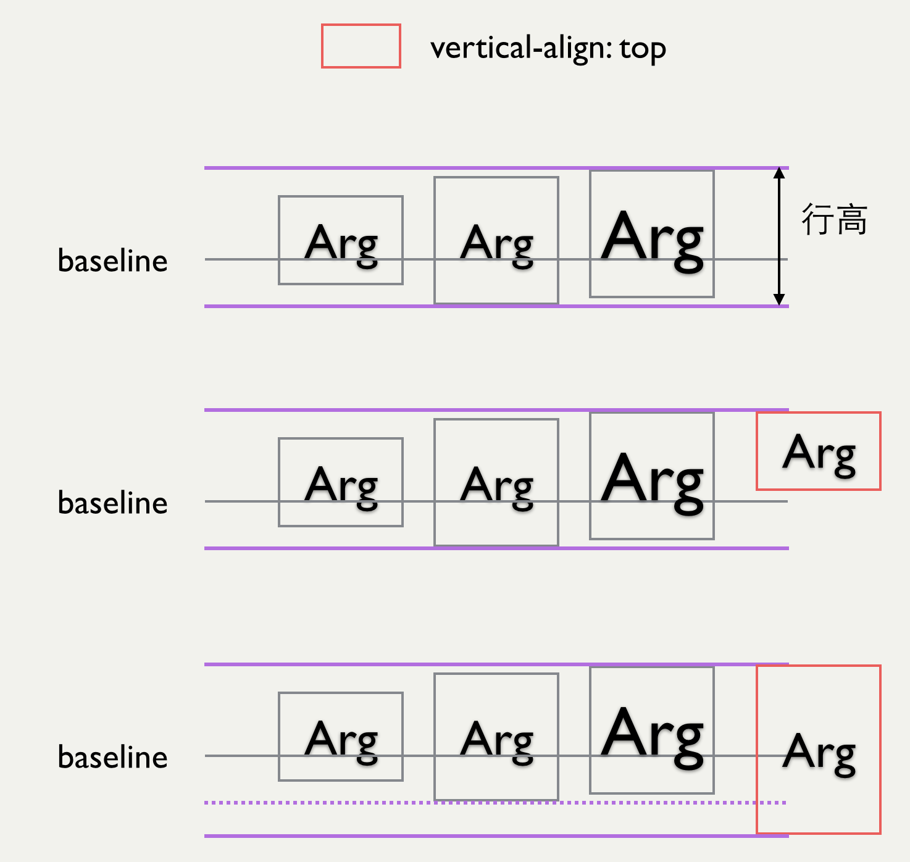
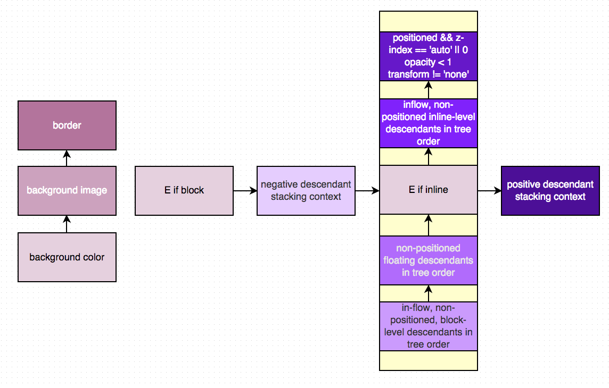

# CSS Layout

## Visual Formatting Model
>In the visual formatting model, each element in the document tree generates zero or more boxes according to the box model.

The layout of these boxes is governed by:

* box dimensions and type.
* positioning scheme (normal flow, float, and absolute positioning).
* relationships between elements in the document tree.
* external information (e.g., viewport size, intrinsic dimensions of images, etc.).

## Viewport
>User agents for continuous media generally offer users a viewport (a window or other viewing area on the screen) through which users consult a document.

## Containing block
>The position and size of an element's box(es) are sometimes calculated relative to a certain rectangle, called the containing block of the element.

### Initial containing block

>The containing block in which the root element lives is a rectangle called the initial containing block

>it has the dimensions of the viewport and is anchored at the canvas origin

## Box type
>Block-level boxes are boxes that participate in a block formatting context.

>An inline box is one that is both inline-level and whose contents participate in its containing inline formatting context.

一个元素一般会产生一个盒子，有些情况下会产生多个（如list-item），但用于定位的一定是其中的主盒子（principal box）。可见，元素的类型会影响其生成的盒子类型。

如果一个元素在渲染后总是形成一个新的内容块（block），则称其为块级元素(block-level element)，如`p`, `div`等（假设无css修改样式）。

如果一个元素的内容可能分布在多行，则称其为行内元素（inline-level element），如`span`, `em`等。

另外，就盒子中的内容而言，如果全是块级盒子，或者该盒子创建了一个IFC (inline formatting context)，则称其为block container box。譬如常见的`div`, `p`, `inline-block`。

除table box，replaced box外，block-level box都是block container box，也被称为block box。而inline-level box中non-replaced inline-block和non-replaced table-cell是block container box。

### 'display'

主要影响盒子类型的还是`display`属性。因此，我们可以通过将一个`span`的`display`设为`block`而将其渲染成块级元素的样子。

### Computed 'display'
[Relationships between display, position, and float](https://drafts.csswg.org/css-position/#dis-pos-flo)

## Positioning schemes

CSS2.1中有三种定位方式：

1. 正常流（normal flow）
2. 浮动（floats）
3. 绝对定位（absolute positioning）

可以通过['position'](http://www.w3.org/TR/CSS2/visuren.html#propdef-position)属性以及['float'](http://www.w3.org/TR/CSS2/visuren.html#propdef-float)属性来选择使用哪种定位。

## Normal flow
>In CSS, normal flow includes block formatting of block-level boxes, inline formatting of inline-level boxes, and relative and sticky positioning of block-level and inline-level boxes.

>Boxes in the normal flow belong to a formatting context, which may be block or inline, but not both simultaneously

正常流排列盒子的方式有两种：横排(horizontal)和竖排(vertical)。

* [正常流中的横排与竖排](https://jsbin.com/lepayu/edit?html,css,output)

### Block formatting context

竖排的盒子总是独占一行，被称为块级盒子(block-level box)。排列在一起的块级盒子所占用的空间称为block formatting context (BFC)。也可以说，用来竖排块级盒子的空间就是BFC。

BFC中盒子的排列特点：

1. 盒子独占一行，从包含块(containing block)的顶部开始向下垂直分布。
2. 每个盒子的left margin-edge (left outer-edge)总是与包含块的左边接邻。
3. 兄弟盒子（sibling boxes）间的垂直距离取决于`margin`属性。垂直方向上相邻的`margin`遵循margin-collapse规则。

#### Examples

* [BFC中盒子的垂直排列](https://jsbin.com/cugowe/1/edit?html,css,output)
* [BFC中盒子的外沿](https://jsbin.com/satogu/edit?html,css,output)

以下元素会创建BFC:

* floats
* absolute positioned elements
* block containers (such as inline-blocks, table-cells, and table-captions) that are not block boxes
* block boxes with 'overflow' other than 'visible'

创建了BFC的盒子拥有的特性：

* 内部BFC中的文本排列不受外部浮动元素的影响。
* 不与子元素发生margin collapse.
* 盒子的高度计算时包括了该BFC中的浮动元素。

#### Examples

* [BFC中文本与外部浮动](https://jsbin.com/satogu/edit?html,css,output)
* [BFC创建者与后代元素的margin collapse](https://jsbin.com/cugowe/edit?html,css,output)

### Inline formatting contexts
>In an inline formatting context, boxes are laid out horizontally, one after the other, beginning at the top of a containing block.

由block container box创建，用于排列inline-level box。其重要的特性是横向一行一行的排，每行的高度由各元素的`vertical-align`和`line-height`决定。

需要注意的是，用于行内排列的盒子并非盒模型确定的盒子。

#### Line height calculations
>user agents flow inline-level boxes into a vertical stack of line boxes

行高的确定步骤：

1. 计算当前行中所有inline-level box的高度。即其[line-height](http://www.w3.org/TR/CSS2/visudet.html#line-height)
2. 根据每个inline-level box的[vertical-align](http://www.w3.org/TR/CSS2/visudet.html#propdef-vertical-align)属性在垂直方向上排列
3. 行高即所有盒子中最靠上的边与最靠下的边的距离。

**NOTE**: 行高只与line-height和vertical-align有关，与盒子的maring, padding, border, height等无关。

#### Example

* [vertical-align与line-height对行高的影响](https://jsbin.com/nuyeke/edit?html,css,output)

### Relative positioning

在盒子按正常流的方式定位好后，可以使用`position:relative`进行偏移。

这里重要的点是：

1. 盒子是相对其在正常流中的位置进行偏移。
2. 其它元素的定位不受该盒子偏移影响。但可能会有重叠现象发生。

## Floats
>In the float model, a box is first laid out according to the normal flow, then taken out of the flow and positioned, typically to the left or right. Content may flow along the side of a float.

>The border box of a table, a block-level replaced element, or an element in the normal flow that establishes a new block formatting context (such as an element with 'overflow' other than 'visible') must not overlap the margin box of any floats in the same block formatting context as the element itself.

浮动，即将盒子移动到当前行的最左或最右的位置。

### 浮动的特点

详细的浮动说明见['float'](http://www.w3.org/TR/CSS2/visuren.html#propdef-float)属性说明。

#### 对其它元素的影响

* 其它元素的定位会忽略浮动元素的存在
* 行宽要为浮动元素的margin box挪空间而变短，但盒子的宽度不变。
* 创建了BFC的盒子其border box不能与所在BFC中浮动元素的margin box有交叠，因此其宽度可能变短。

#### 浮动元素的outer edge受其containing block的限制

* 浮动元素的margin box不能伸出其containing block的上边、左边、右边。
* 尽可能靠上
* 左浮动元素尽可能地靠左
* 右浮动元素尽可能地靠右

#### 浮动元素之间可能互相限制

* 左浮动元素必须在前面左浮动元素的右边或下边。
* 右浮动元素必须在前面右浮动元素的左边或下边。
* 左浮动元素必须在相邻右浮动元素的左边。
* 右浮动元素必须在相邻左浮动元素的右边。

#### 受前面元素的限制

* 不能比文档中在前的block (block-level box, block container)、浮动元素更靠上
* 不能比文档中在前的line box更靠上

##### Example

* [float与前后元素](https://jsbin.com/hivafo/edit?html,css,output)

### 清除浮动
浮动带来的效果：

1. 文本可能绕图片排列，不呈现矩形块状。
2. 父元素高度的计算可能不包括浮动元素的高度，出现塌陷现象。
3. 创建了BFC的盒子，其border box可能变窄。

一般说clear a float，指的是使clear space for the target element，即让目标元素和浮动元素保持一定距离以免受上述效果。

可使用[clear](http://www.w3.org/TR/CSS2/visuren.html#propdef-clear)属性来达到目的。另外，使某些元素创建BFC也能达到某些效果。

## Absolute positioning
>In the absolute positioning model, a box is removed from the normal flow entirely (it has no impact on later siblings) and assigned a position with respect to a containing block.

绝对定位的元素彻底脱离了正常流，完全不影响原来流的layout。

绝对定位的元素创建了BFC，形成一个新的正常流。

可通过[position](http://www.w3.org/TR/CSS2/visuren.html#propdef-position)属性来指定绝对定位。

**NOTE**: 绝对定位盒子的containing block是最近的祖先positioned box的padding edge（如果该祖先盒子为block-level）.

### Example

* [绝对定位的top与left含义](https://jsbin.com/nakeha/edit?html,css,output)

### Fixed positioning
>Fixed positioning is a subcategory of absolute positioning.

与绝对定位唯一的差别在于fixed positioning的元素，其containing block是由viewport创建的。即元素相对于视口定位。

## Layered presentation

CSS中每个盒子都有一个三维的位置信息，前面的定位机制都是指定了二维的信息（x-y平面）。

如果元素的`position`属性值不为`static`，则称其为`positioned element`，其产生的盒子称为`positioned box`。

使用相对定位或绝对定位可能出现盒子重叠的情况，此时可以使用[z-index](http://www.w3.org/TR/CSS2/visuren.html#propdef-z-index)来指定stack level（哪个在上）。这便是第三维的位置信息。

### Stacking context
根元素或`z-index`为`auto`的元素会创建一个stacking context。

该元素的后代元素（如果它们不新建stacking context的话）都存在于该stacking context中，通过stacking level（即各自的`z-index`的值）来决定谁前谁后。

**NOTE**: z-index的比较只对同一个stacking context中的元素起作用。当两个元素处于不同的stacking context中时，必须找到它们处于同一个stacking context中的祖先，由其祖先的z-index决定谁前谁后。所以，这是一个拼爹的属性。

#### Example

* [z-index的作用是要拼爹的](https://jsbin.com/tibami/edit?html,css,output)

### z-index

* `z-index`只对positioned element有效果
* `z-index`用于指定stack-level
* `z-index`用于创建stacking context

### More info
* <https://drafts.csswg.org/css-position/#layered-presentation>

## Sizing and positioning details
See [here](https://drafts.csswg.org/css-position-3/#size-and-position-details)

## Definitions

### out of flow
>An element is called out of flow if it is floated, absolutely positioned, or is the root element.

### in flow
>An element is called in-flow if it is not out-of-flow.

### flow
>The flow of an element A is the set consisting of A and all in-flow elements whose nearest out-of-flow ancestor is A.

### positioned element/box
>An element is said to be positioned if its position property has a value other than static.

>Positioned elements generate positioned boxes

## More

* <http://www.w3.org/TR/CSS2/visuren.html>
* <https://drafts.csswg.org/css-position/>
* <https://drafts.csswg.org/css-display/>
* <https://drafts.csswg.org/css-inline/>
* <https://drafts.csswg.org/css-flexbox/>
* <https://drafts.csswg.org/css-align/>
* <https://drafts.csswg.org/css-overflow/>

