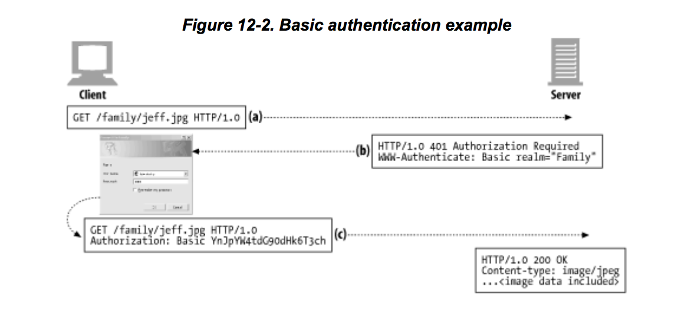
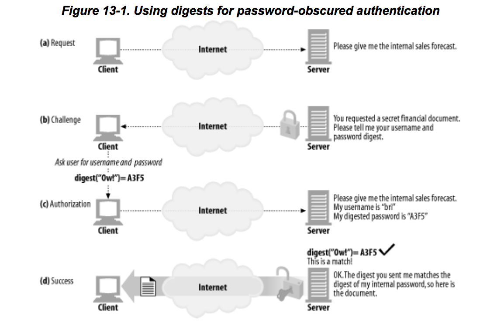
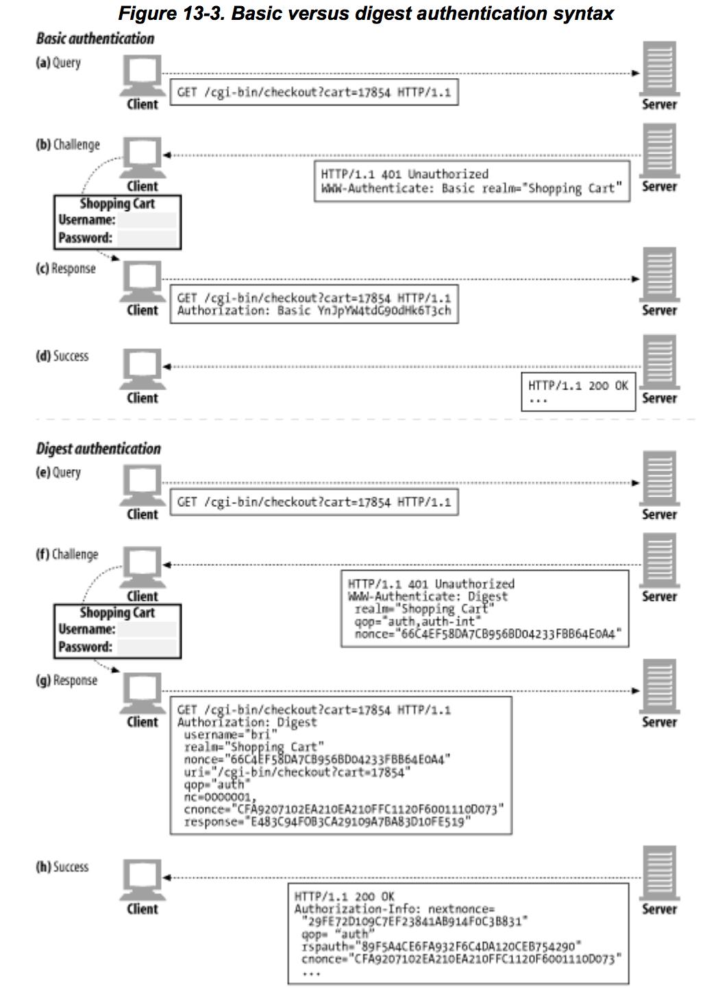

# Authentication
《[HTTP: The Definitive Guide]》阅读笔记。

>Authentication means showing some proof of your identify.

当用户访问某些隐私信息时，需要用户提供身份证明，通常就是填写用户名和密码。

## Basic Authentication


* 用户请求`/family/jeff.jpg`
* 服务器响应`401`，要求进行`basic authentication`
* 浏览器收到`401`响应，弹出对话框让用户输入用户名和密码。随后浏览器用冒号连接用户名和密码（`username:password`），用[base-64]进行编码后添加`Authorization`头，再次请求`/family/jeff.jpg`。
* 服务器解码后，验证通过，响应`200`。

### 安全隐患
* 用户名和密码使用[base-64]编码传输，一旦被获取后很容易就解码。
* 即便使用了一种非常难以解码的算法进行编码，第三方拿到加密的东西后，还是可以用这个加密的东西去向服务器发请求，根本不需要解码。称之为`replay`攻击。
* 即便是在不重要的场合下使用[basic authentication]，第三方拿到用户名密码后，可以去其它场合尝试。很多人会在不同场合使用同样的用户名和密码组合。
* 网络代理也可以只修改请求内容，而不修改请求头，从而完全改变请求行为。
* 还可以伪装服务器，诱使用户输入用户名和密码。

[basic authentication]需要结合SSL等技术一起使用以满足安全性的要求。

## Digest Authentication


* 用户请求受保护文档。
* 服务器要求提供用户名和密码的某种加密形式（密码摘要，a digest form of password）
* 用户提供用户名和密码摘要
* 服务器存储了所有用户的密码摘要，直接对比两个摘要是否吻合。

### digest
>A digest is a "condensation of a body of information".

实际上就是一个单向映射，将无穷多可能的值映射到某个有限集合中。
譬如[MD5]，将任意长度的字节映射成128位（的摘要）。

这些映射最重要的特点是，如果不知道密码，需要花费很长的时间才能猜中对应的摘要；知道摘要，需要花费很长时间才能计算出密码。

[MD5]的128位经常写成32个16进制的字符（每个代表4位）。也就是说，[MD5]将任意长度的输入映射成32个字符。

摘要本身还不能防止`replay`攻击，为此，服务器可以传给客户端一个`nonce`，客户端可以将其连接到密码摘要后面再发给服务器。
由于这个`nonce`可以变动频繁，或者是每次请求都不一样，即使拿到了这个“摘要:nonce”，也很快便会失效。

[digest authentication]支持多种算法，RFC 2617中推荐[MD5]和MD5-sess。默认是[MD5]。

**计算公式**
```
KD(H(A1), <nonce>:<nc>:<cnonce>:<qop>:H(A2))

```

实际中，前面的公式展开后为：
```
MD5(MD5(A1):<nonce>:<nc>:<cnonce>:<qop>:MD5(A2))

```

#### H与KD
```
H(d) = MD5(d)
KD(s, d) = MD5(s:d)

```

#### A1与A2
请求信息被分为两部分：
* `A1`代表秘密相关的部分
* `A2`代表秘密不相关的部分

RFC 2617定义了两种方式来计算`A1`。
* `MD5`。每次请求都需要执行一次单向哈希函数。
```
A1 = <user>:<realm>:<password>
```

* `MD5-sess`。哈希函数只在WWW-Authenticate握手时执行一次。
```
A1 = MD5(<user>:<realm>:<password>):<nonce>:<cnonce>

```

`A2`代表的是消息本身，如URL，请求方法（request method），消息实体（entity body）。
可用来防止消息被恶意篡改。

RFC 2617也定义了两种计算`A2`的方式。
* `qop="auth"`。只包含URL和请求方法。
```
A2 = <request-method>:<uri-directive-value>

```

* `qop="auth-init"`。添加了消息实体。
```
A2 = <request-method>:<uri-directive-value>:H(<request-entity-body>)

```

`qop`即`quality of protection`。

#### nonce
RFC 2617推荐的生成方法：
```
nonce = BASE64(time-stamp H(time-stamp ":" ETag ":" private-key))

```

`time-stamp`为时间戳，或是其它不会重复的值。
`ETag`即对应的请求头值，和请求实体绑定。
`private-key`是只有服务器知道的秘密。

服务器在收到客户端的`Authorization`请求头后，重新计算哈希部分（`H()`），
并检查其是否与`Authorization`头中的`nonce`值吻合。

服务器在计算哈希进行对比验证时，需要上次的`time-stamp`，
可以对`Authorization`头中的`nonce`先进行[base-64]解码，去掉后面32个字符得到。

`ETag`可从请求头中取得。`private-key`应该是不变的吧。

### 其它安全考虑
#### 请求头篡改
[digest authentication]只对WWW-Authenticate和Authorization请求头进行了一定程度的防护，要想保证其它请求头不被篡改，需要对请求头进行端到端加密或数字签名。

#### Replay Attacks
blabla

推荐做法是`nonce`值只对一次`transaction`有效，且设置`timeout`。

#### Dictionary Attacks
第三方可以长时间地监听`http transaction`，搜集`nonce/response`对，然后用密码推测程序去猜密码。
为了应对这种攻击，最好地策略是使用复杂密码，且定期换密码。

#### Hostile Proxies and Man-in-the-Middle Attacks
很多请求都经过代理，代理便能进行监听，或者是将认证协议改成[basic authentication]。

这个问题除了使用SSL外，基本无解。

#### Chosen Plaintext Attacks
客户端利用服务器提供的`nonce`来计算其`response`，
所以，代理或服务器便可能在`nonce`上做手脚来获得密码。

**Precomputed dictionary attacks**

结合了Dictionary Attacks的特点。
事先利用一些`nonce`和密码生成对应的`response`，
然后将这些`nonce`发给客户端，收到`response`后再去查，一旦匹配上便知道了密码。

**Batched brute-force attacks**

与前一种方式的不同之处在于，并不是从事先算好的`response`中去找匹配，
而是直接根据`response`去穷举。

此种攻击容易破解，只需要开启`cnonce`。
这个值是由客户端计算出来的，根据它去计算`response`便基本防止了从`nonce`和`response`去猜密码的可能性。

#### Storing Passwords
[digest authentication]机制将用户的`response`与服务器存储的信息做对比，
这些信息（通常是用户名，`H(A1)`）一旦被暴露，从前面的公式可以看出，便可以不需要解出密码，而直接根据服务器的`nonce`去计算`response`，进行攻击。

这种攻击基本上也是无解的，减轻的方法是：
* 服务器将这些信息更妥善的保管
* 尽量设置好`realm`，一旦被暴，影响也是局部的。

### 对比


* 不明文传输密码。
* 防止`replay`攻击。
* 防止恶意修改请求内容。
* 及其它一些常见的攻击手段。

## 真正安全的可行方案
真正安全地作法就是使用SSL。

[base-64]: https://en.wikipedia.org/wiki/Base64
[MD5]: https://en.wikipedia.org/wiki/MD5
[basic authentication]: #basic-authentication
[digest authentication]: #digest-authentication
[HTTP: The Definitive Guide]: http://www.staroceans.org/e-book/O'Reilly%20-%20HTTP%20-%20The%20Definitive%20Guide.pdf

